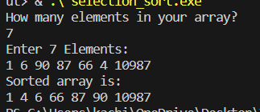

# Selection-Sort
A cpp code showing basic implementation of Selection sort.
## Theory
Selection sort is a simple and efficient sorting algorithm that works by repeatedly selecting the smallest (or largest) element from the unsorted portion of the list and moving it to the sorted portion of the list. 
### Advantages of Selection Sort Algorithm
- Simple and easy to understand.
- Works well with small datasets.
### Disadvantages of the Selection Sort Algorithm
- Selection sort has a time complexity of O(n^2) in the worst and average case.
- Does not work well on large datasets.
- Does not preserve the relative order of items with equal keys which means it is not stable.
## How it works
There are some important steps, lets try to sort an array buy smallest to largest as an example
1. IN The whole array, the values are compared and the smallest is swapped with the first element of the array.
2. IN the next iteratiuon,rest of the elements excepty the first one are compared and the smallest value is put in the second index.
3. Ans so on the array gets sorted.
## Explaination
1. We enter the no. of elements in the array
2. Then we enter those number of elementsal values
3. A user defined function named sort tales the array's address and its number of elements as arguments and sorts the array
4. Then the arrayt is printed out
## OutPut ScreenShot

